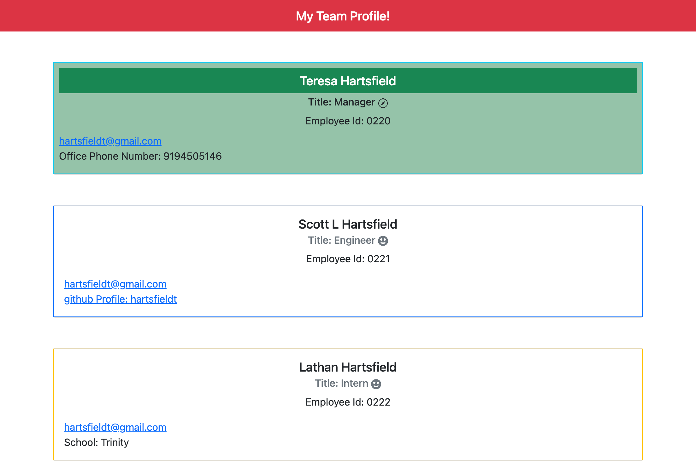
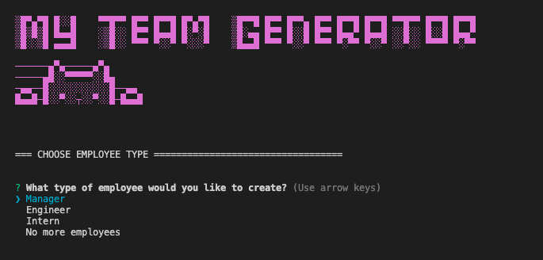
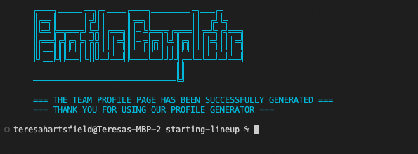

# Team Profile Generator

## Purpose

To generated an HTML page that displays a managers team information.

## Requirements

The user must be presented with a CLI application that:
- Prompts a menu to select an employee type and then the user must provide their information
- The selections generate an HTML file that displays a nicely formatted team roster based on the user input
- GitHub username and email are clickable and open into new tabs.
- When prompted enter the follow based on position title:
    - Manager: name, employee ID, email address, and office number.
    - Engineer: name, ID, email, and GitHub username.
    - Intern: name, ID, email, and school.
- Returns to the employee menu and has the option to be finished with building the team.

## Screencastify
Video Demo for application use

https://drive.google.com/file/d/1_X1zf-aqtzNrme7-pPsfLj7CUJm20lFS/view?usp=sharing

Video Demo for testing (Used Youtube as Google was not working for me)
https://youtu.be/jkBXOBQVwjs
## Website

https://hartsfieldt.github.io/starting-lineup/

file:///Users/teresahartsfield/repos/challenges/starting-lineup/dist/index.html

## Git Hub

https://github.com/hartsfieldt/starting-lineup

## Contribution

Made with ❤️ by Teresa Hartsfield

## Front End

## Back End

